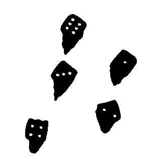
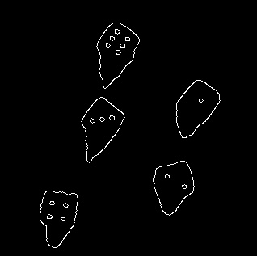

# Atividade Avaliativa - Sistemas Multimídia

- Aluno: Henrique da Silva Garcia
- ADS V

## Questão 01

### Tons de Cinza

### Blur

### Binarização

### Detecção de Bordas - Canny

## Questão 02

- <strong>Local: </strong> Vias públicas e estabelecimentos

- <strong>Problema: </strong> <i>Ferramenta de Auxílio à Deficientes Visuais em locais onde fosse impossibilitado o uso do Cão-guia</i>

- <strong>Descrição: </strong> A solução seria integrada a um dispositivo que pudesse ser encaixado na parte onde os deficientes visuais seguram a bengala e ao mesmo tempo integrada com uma pequena câmera discreta colocada no óculos. O dispositivo que fosse ficar na região da bengala teria que ogrigatoriamente possuir um mecanismo de vibração como sinal de alerta quando a câmera detectasse algo que pudesse ocasionar na dificuldade de locomoção do cidadão.
